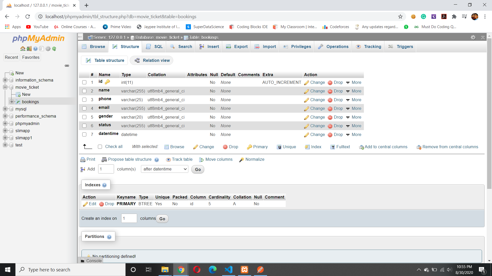
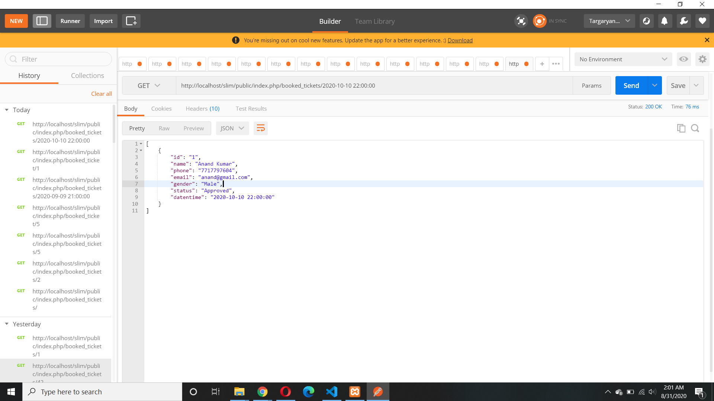
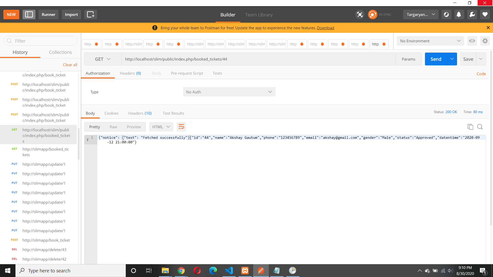
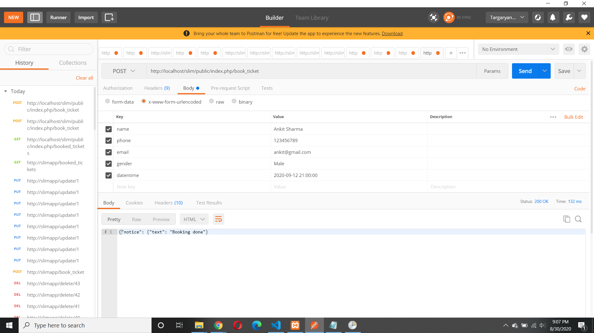
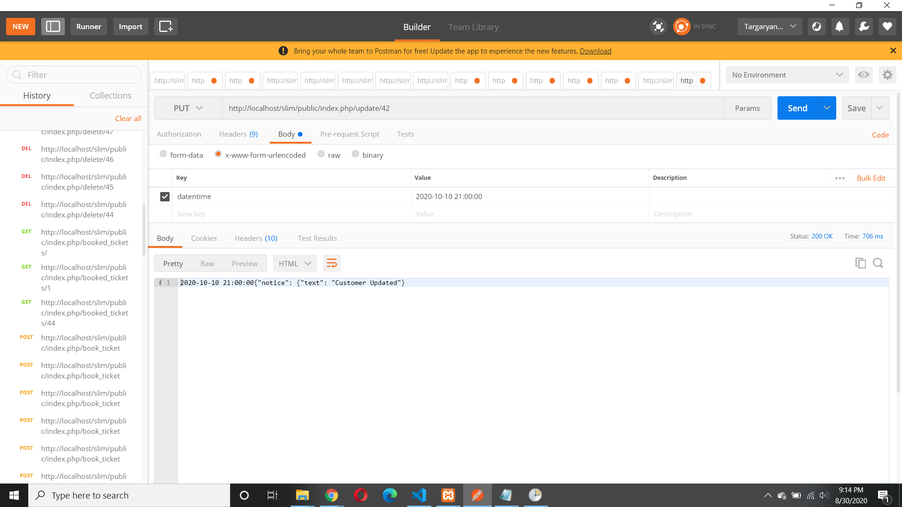
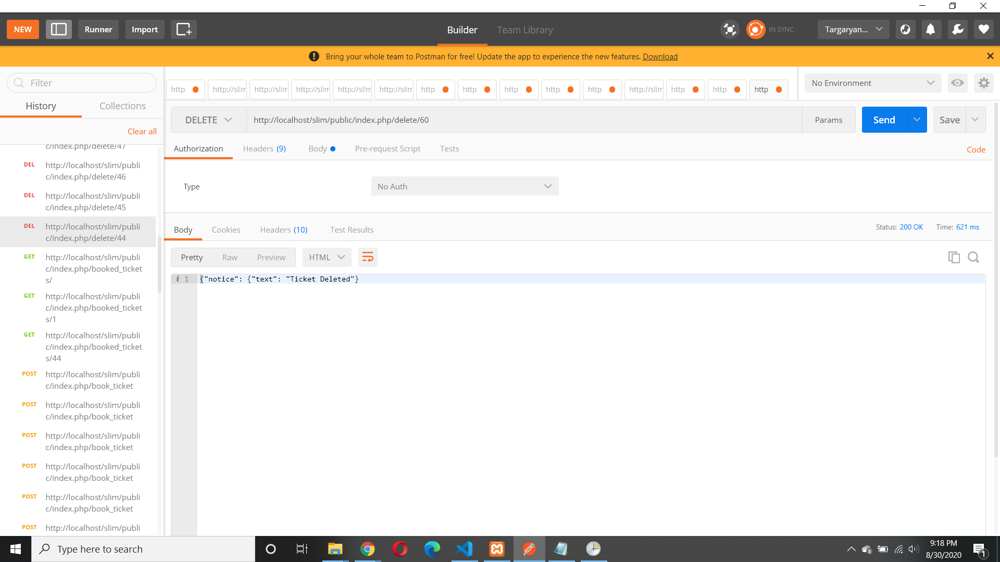
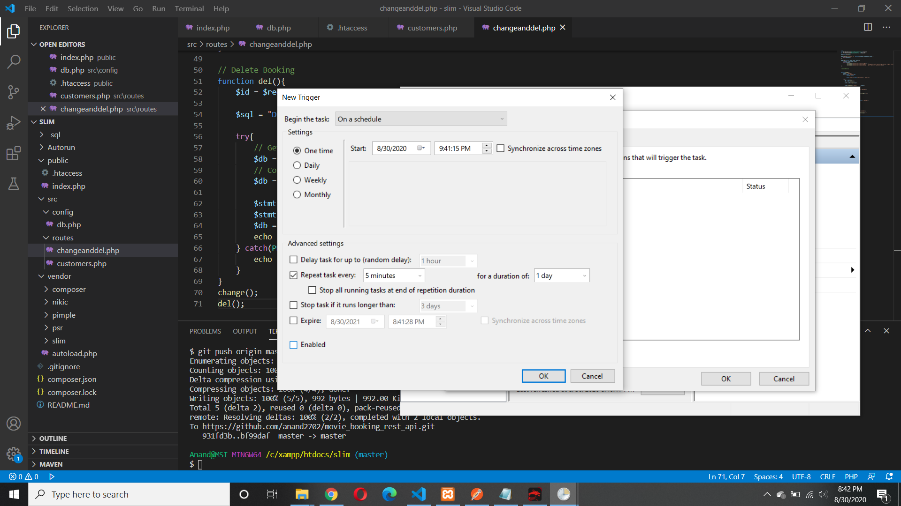
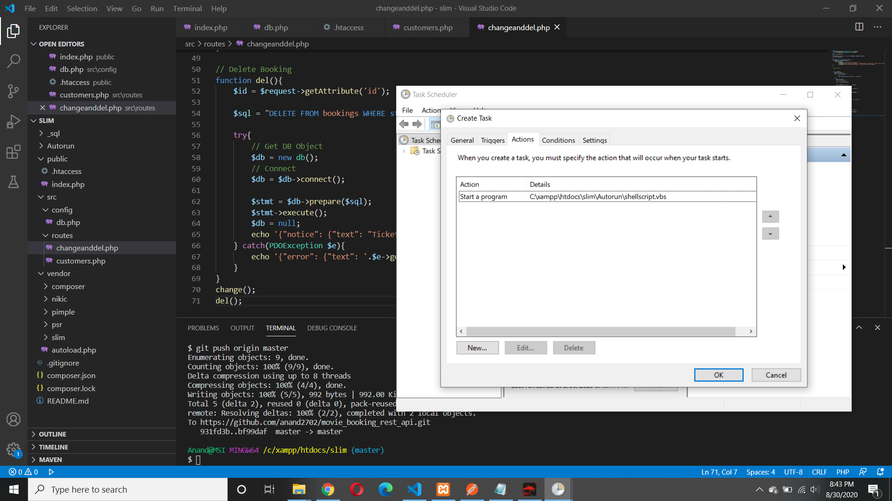
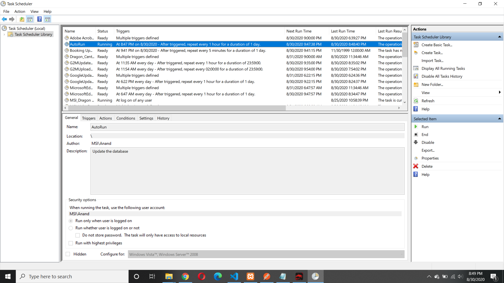
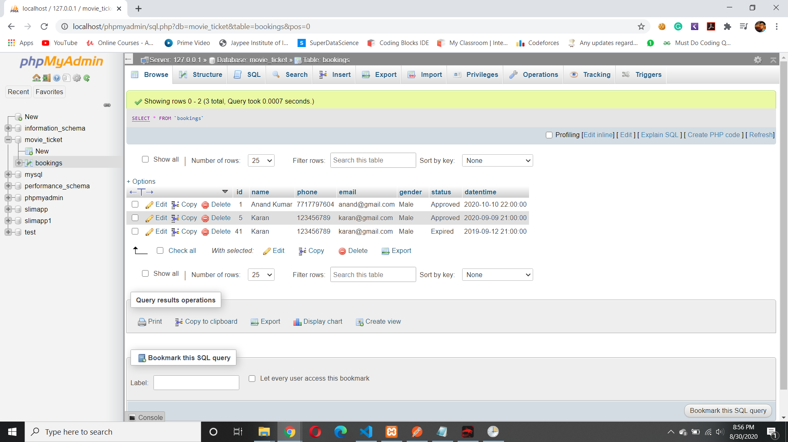

# Booking REST API

This is a REST api built with the SlimPHP framework and uses MySQL for storage.

This API helps fetch ticket data from Database, or update, delete or create tickets. Also, tickets are automatically deleted after 8 hours of their show time and there can be a maximum of 20 bookings at a particular time. 


## Assumptions

1.As no details about timing was provided, it is assumed that the timing is in 24-hours format

2.It is assumed that the bookings are made taking into account only start time, no end time is considered for a show.

3.Movie length isn't considered in booking ticket.


### Description

A table named bookings has been created with the following given description.




### Usage
### Installation

Create database or import from _sql/movie_ticket.sql

Edit db/config params

Install SlimPHP and dependencies

```sh
$ composer
```
### API Endpints
```sh

$ GET http://localhost/slim/public/index.php/booked_tickets/{timing}  ->  It displays a list of all the bookings made along with user details.
```



```sh

$ GET http://localhost/slim/public/index.php/booked_ticket/{id}  ->  It displays the details of booking of that specific id.
```



```sh

$ POST http://localhost/slim/public/index.php/book_ticket  ->  It is used to make a new booking which takes care that there are no more than 20 bookings on any date and time. The input parameters required are "name","phone","email","datentime" and "gender".
```





If there are more than 20 bookings at a particular date and time then an error message is shown.


[](ScreenShots/Error_booking.png)


```sh
$ PUT http://localhost/slim/public/index.php/update/{id}  ->  It modifies the booking datentime of column and again takes care of the condition that there are no more than 20 bookings at that date and time. The input parameter required is "datentime".
```

```sh

After updation the booking details are changed.
```


```sh

$ DELETE http://localhost/slim/public/index.php/delete/{id}  ->  It is used to delete the ticket with that specific id.
```




```sh
### Now to auto update the status to expired and then delete the expired tickets we will need Cron Job.
We need two files one to run the script that we want torun at a specific time interval and the other to give the location.
Those two files are provided in Autorun.
```

Now, we are ready to set the Windows Task Scheduler to run shellscript.vbs at the required time interval:

1.Open Task Scheduler from windows Start menu

2.Go to Action menu and hit Create Task...

3.in General tab, fill the Name and Description fields as you want

4.in Triggers tab, hit New button.

5.from Begin the Task dropdown, select On a schedule and choose Daily

6.from Advanced settings section, select Repeat task every as you want and set for a duration on Indefinitely.

7.on Actions tab, from Action dropdown, select Start a program.

8.on the Program\script box, enter path to shellscript.vbs like C:\path\to\shellscript.vbs.

9.leave Add argumentts (optional) section empty.

10.in Start in (optional) box, enter parent directory of shellscript.vbs like C:\path\to\.

Steps to do so in form of ScreenShots are given below:-






### Proof that it is autorunning properly:-




```sh
Ouput after running the autorun program i.e updating ticket to expired and then deleting it.
```



